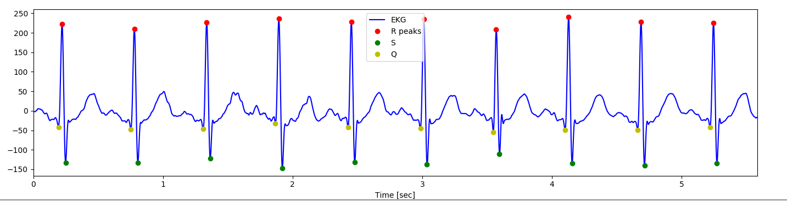
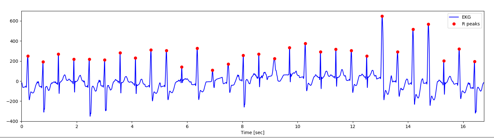

# Q, R, and S Detection from ECG
This is a general prototype of Q, R, S detection on ECG including Q and S point label inspired by "Pan-Tompkins" algorithms. 




### Dependencies
- Numpy
- Matplotlib

### run example
```
~$ git clone https://github.com/KChen89/QRS-detection.git
~$ cd /your folder
~$ python3 QRS.py ECG_sample.dat
```

Testing data needs to be in the **data** folder in single column format. 

#### More
- [x] R peak detection.
- [x] Q,S point label
- [x] Deal with abnormal beats
- [ ] Real time detection.
- [ ] Other platform (Mobile).

##### Reference
[1] K. Chen, W. Fink, J.M. Roveda, et al., "Wearable Sensor Based Stress Management Using Integrated Respiratory and ECG Waveforms", IEEE 12th International Conference on Wearable and Implantable Body Sensor Networks (BSN), 2015. <br/>
[2] K. Chen, L.S. Powers, J.M.Roveda, "Noise-Invariant Components Analysis for Wearable Sensor based Electrocardiogram Monitoring System". <br/>
